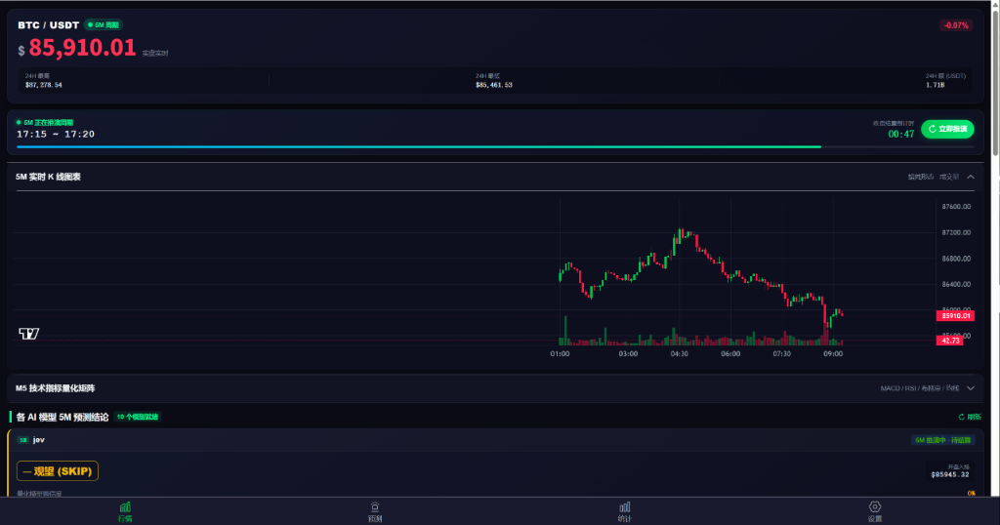
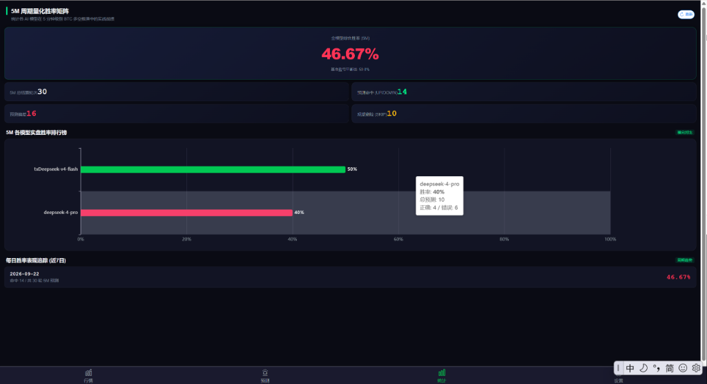
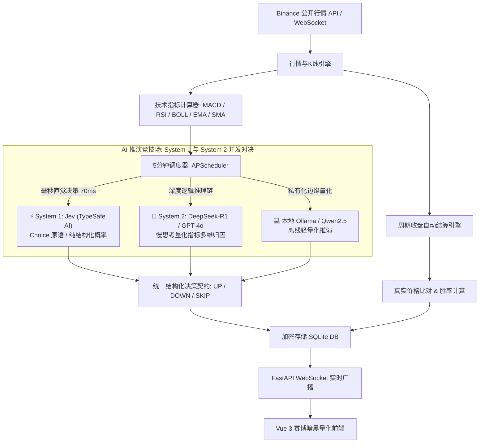

<div align="center">

# ⚡ VectorBTC

**基于多 AI 大模型并发推演的比特币 5 分钟（M5）高频量化涨跌预测竞技场**

*5-Minute High-Frequency BTC Quantitative UP/DOWN Prediction & Multi-AI Model Arena*

[](LICENSE)
[](https://openrouter.ai/models/typesafe/jev-latest)
[](https://www.python.org/)
[](https://fastapi.tiangolo.com/)
[](https://vuejs.org/)
[](https://vitejs.dev/)
[](docker-compose.yml)
[](https://github.com/koala9527/vectorbtc/pulls)

[English](./README_EN.md) | **简体中文**

</div>

---

## 📖 项目简介 / Introduction

**VectorBTC** 是一套专为加密货币（BTC/USDT）设计的 **5 分钟（M5）级高频涨跌预测与多 AI 模型实战对决系统**。

系统以 5 分钟 K 线周期为最小节拍，实时拉取币安公开行情并秒级计算 **MACD、RSI、布林带、EMA7/25、SMA99** 等技术量化指标，作为严格的结构化决策依据，同时驱动多个 AI 模型进行下一周期的多空（UP/DOWN/SKIP）推演：
- ⚡ **System 1 (快决策 / 盘口直觉)**：率先支持由前 OpenAI 团队 TypeSafe AI 研发的 **Jev** 决策模型（70ms 极低延迟，非自回归结构化概率输出，成本降低 400x）；
- 🧠 **System 2 (慢思考 / 深度推理)**：无缝支持 **DeepSeek-R1 / V3**、**GPT-4o**、**Claude 3.5 Sonnet**、**通义千问** 与本地私有化 **Ollama** 等深度思维链大模型。

每个周期收盘时，系统自动核对实际结算价格，评定 AI 推演胜负，沉淀实盘数据，并通过全网胜率矩阵与排行榜直观呈现谁才是真正的“量化之王”。

---

## 📸 界面效果展示 / Screenshots

| 5M 实时行情与量化推演看板 | 5M 周期量化胜率矩阵与排行 |
| :---: | :---: |
|  |  |

---

## ✨ 核心特性 / Features

- ⏱️ **5分钟极速量化闭环**
  - 行情头图动态展示「5M 周期」状态灯，主界面清晰指示当前正在推演的区间（如 `17:15 ~ 17:20`）。
  - 内置精确到秒级的收盘结算倒计时与 5M 蜡烛走势动态进度条。
- ⚡ **前沿 System 1 (Jev) 与 System 2 (DeepSeek/GPT) 双系统对决**
  - **Jev (TypeSafe AI) 毫秒直觉**：前 OpenAI 研究员推出的决策大模型，专精非生成式结构化决策（`Choice` 原语），70ms 极低延迟，零 Token 废话与幻觉，推理成本直降 400x。
  - **DeepSeek-R1 / GPT-4o 深度思维链**：华尔街量化师 Prompt 约束，深度剖析指标支撑阻力与多周期共振。
  - 打造业内首个「毫秒级盘口本能哨兵」与「慢思考战术军师」同台竞技的实盘量化竞技场！
- 🤖 **多 AI 模型实战竞技场（Model Arena）**
  - 允许同时接入多个大模型（支持任意 OpenAI 兼容 API：DeepSeek、OpenAI、Claude、OneAPI、Ollama 等）。
  - API Key 采用 Fernet 工业级对称加密存储，界面展示自动脱敏。
- 📊 **严谨且令人信服的量化决策提示词**
  - 系统内置华尔街级高频量化分析师 Prompt，硬性约束模型必须引用实时计算的数字依据（RSI数值、MACD柱高、EMA交叉状态、布林带突破情况与大级别均线支撑）。
  - 支持 `SKIP`（观望防守），模型在震荡不确定时不下单，保护整体胜率。
- ⚖️ **全自动周期结算与胜率引擎**
  - APScheduler 毫秒级任务调度，每 5 分钟烛线收盘自动拉取币安真实结算价。
  - 自动对账、判断对错、统计全模型综合胜率、各模型实盘胜率排行榜及近 7 日胜率走势。
- 🎛️ **一键模型管理与动态数据屏蔽（Shielding）**
  - 支持随时添加、编辑、测试模型连通性与推演延迟。
  - **一键停用/启用开关**：模型停用后，其历史数据自动在行情主页、预测流水、统计大盘中隐藏，后台停止调度该模型以节省 Token。
- 🌌 **赛博朋克暗黑量化终端 UI**
  - 基于 Vue 3 + Vant 4 + ECharts + Lightweight Charts 打造。
  - 极简高对比黑金/霓虹绿配色，针对移动端触控优化，支持手机浏览器局域网真机调试。
- 🐳 **开箱即用全栈 Docker 化**
  - 提供 `docker-compose.yml`，内置 Nginx SPA 反向代理与 WebSocket 长连接支持。
  - 数据目录挂载持久化，升级容器绝不丢失 SQLite 历史实盘库。
  - 集成 GitHub Actions 自动化 CI 语法、类型与构建检查。

---

## 🏗️ 系统架构 / Architecture



---

## 🚀 快速开始 / Quick Start

### 方式一：Docker Compose 一键部署（推荐）

确保本地已安装 [Docker](https://www.docker.com/) 与 [Docker Compose](https://docs.docker.com/compose/)。

```bash
# 1. 克隆代码仓库
git clone git@github.com:koala9527/vectorbtc.git
cd vectorbtc

# 2. 复制环境配置文件
cp .env.example .env

# 3. 启动全栈容器服务
docker compose up -d

# 4. 查看运行状态
docker compose ps
```

* 前端量化终端：**http://localhost:8029**（可在 `.env` 中通过 `FRONTEND_PORT` 自定义）
* 后端 API 文档：**http://localhost:8009/docs**（可在 `.env` 中通过 `BACKEND_PORT` 自定义）

---

### 方式二：本地开发环境运行

#### 1. 后端 (FastAPI + Python 3.12)

```bash
cd backend

# 创建并激活 Python 虚拟环境
python -m venv venv
# Windows:
.\venv\Scripts\activate
# Linux / macOS:
source venv/bin/activate

# 安装依赖
pip install -r requirements.txt

# 复制配置文件
cp .env.example .env

# 启动后端服务
uvicorn app.main:app --host 0.0.0.0 --port 8000 --reload
```

#### 2. 前端 (Vue 3 + Vite)

```bash
cd frontend

# 安装依赖
npm install

# 启动开发服务器
npm run dev
```

#### 3. Windows 用户便捷脚本
Windows 用户可直接在根目录下双击运行：
* **`start_all.bat`**：一键并行启动前后端服务。

---

## ⚙️ 配置说明 / Configuration

### 环境变量 (`.env`)

| 变量名 | 默认值 | 说明 |
| :--- | :--- | :--- |
| `APP_NAME` | `vectorbtc` | 应用名称标识 |
| `APP_ENV` | `development` | 运行环境 (`development` / `test` / `production`) |
| `DATABASE_URL` | `sqlite+aiosqlite:////app/data/vectorbtc.db` | 异步 SQLite 连接串（容器内路径） |
| `BINANCE_BASE_URL`| `https://api.binance.com` | 币安公开数据 API 域名 |
| `SYMBOL` | `BTCUSDT` | 预测目标标的 |
| `INTERVAL` | `5m` | K 线周期 |
| `SCHEDULER_INTERVAL_MINUTES` | `5` | 自动推演与结算的周期时长（分钟） |
| `SECRET_KEY` | `...` | 用于加密 AI 模型 API Key 的对称密钥 |
| `BACKEND_PORT` | `8009` | Docker 映射到宿主机的后端端口 |
| `FRONTEND_PORT`| `8029` | Docker 映射到宿主机的前端端口 |
| `COMPOSE_SUBNET` | `10.253.241.0/28` | Docker 自定义内部子网，防网段冲突 |

---

## 🤖 AI 模型配置参考 / Model Configuration

系统采用 OpenAI 标准 API 协议，打开系统「设置」页面即可点击「添加模型」：

| 平台 / 模型 | Base URL | Model Name | 备注 |
| :--- | :--- | :--- | :--- |
| **TypeSafe Jev (System 1)** ⚡ | `https://openrouter.ai/api/v1` | `typesafe/jev-latest` | **前 OpenAI 团队打造的快决策模型**。非自回归，70ms 极低延迟，零 Token 废话，成本降低 400x，输出确定性概率分布 |
| **DeepSeek V3 / R1 (System 2)** | `https://api.deepseek.com/v1` | `deepseek-chat` / `deepseek-reasoner` | 高性价比，强逻辑思维链深度推演 |
| **OpenAI** | `https://api.openai.com/v1` | `gpt-4o` / `gpt-4o-mini` | 经典通用基准模型 |
| **通义千问 (Qwen)** | `https://dashscope.aliyuncs.com/compatible-mode/v1` | `qwen-plus` / `qwen-turbo` | 阿里云兼容接口 |
| **月之暗面 (Kimi)** | `https://api.moonshot.cn/v1` | `moonshot-v1-8k` | 长文本上下文 |
| **本地 Ollama** | `http://host.docker.internal:11434/v1` | `qwen2.5:7b` / `llama3.1` | 完全离线私有化运行 |

> 💡 **提示**：每张模型卡片支持 **「测试连接」**，点击后系统将立即以当前最新行情与技术指标执行一次真实的 M5 模拟推演，并在弹窗中输出毫秒级响应延迟与决策依据。

---

## ⚡ 聚焦前沿：Jev (TypeSafe AI) System 1 决策模型深度实践

2026 年 9 月，由前 OpenAI 研究员 Diogo Almeida 创立的 **TypeSafe AI** 正式发布了颠覆性的 **Jev** 模型（`typesafe/jev-latest`）。这一发布在 AI 与金融科技界引发了广泛震动——它宣告了 AI 从单纯“文本聊天与代码补全”迈入了**专精结构化概率决策的“System 1 快思考”新纪元**。

VectorBTC 率先将 Jev 融入加密资产的 5 分钟高频推演体系中，实现量化投资领域的 **卡尼曼双系统模型（Kahneman Dual-Process Quantitative Theory）**：

### 1. 为什么 5 分钟高频量化需要 Jev？

传统生成式大语言模型（LLM）擅长在充足时间内展开长上下文深度推理（System 2 慢思考），但在高频交易场景面临三大天然制约：
1. **生成延迟长**：逐 Token 自回归生成，端到端延迟通常在 2~6 秒，难以应对行情瞬息万变；
2. **格式幻觉风险**：偶发的 Markdown 代码块截断或 JSON 解析失败会导致高频策略漏单；
3. **调用成本累积**：高频推演（每日 288 个周期 × 多模型并发）消耗巨额 Token。

**Jev 带来的颠覆性解决方式：**
- **非自回归（Non-Autoregressive）结构化输出**：直接输出机器可读的结构化概率决策，完全剥离无用的自然语言修辞废话；
- **极致亚秒响应（70ms ~ 500ms）**：决策速度比通用大模型快上百倍，宛如为量化系统装上了“毫秒级神经反射弧”；
- **推理成本直降 400x**：百万 Token 成本仅约 $0.042，实现全天候无压力高并发巡航推演；
- **原生零幻觉**：输出严格受控于选择集（Choice），保证 100% 格式安全。

### 2. 双系统在 VectorBTC 中的实战分工

| 特性对比 | ⚡ System 1: Jev 决策模型 | 🧠 System 2: DeepSeek-R1 / GPT-4o |
| :--- | :--- | :--- |
| **理论隐喻** | **快思考：盘口瞬时直觉反应** | **慢思考：华尔街分析师深度归因** |
| **核心机制** | 概率分类原语 `Choice(UP, DOWN, SKIP)` | 复杂思维链（Chain-of-Thought）逐步求证 |
| **典型延迟** | **70ms ~ 200ms** | 1,500ms ~ 5,000ms+ |
| **输出物** | 方向判定 + 各分支严格置信度百分比 | 详细的指标分析论述、阻力支撑复盘文本 |
| **实战策略** | **高频盘口尖刀兵**（捕捉瞬态破位与极端超买超卖） | **战略推演军师**（多周期共振与宏观技术形态确认） |

### 3. 如何在 VectorBTC 中体验 Jev 的极速推演？

Jev 已通过 OpenRouter 全面开放标准 OpenAI 兼容接口，你可以在 1 分钟内完成接入：
1. 在 [OpenRouter](https://openrouter.ai/) 获取你的 API Key；
2. 打开 VectorBTC 前端「设置」-> 点击「添加模型」；
3. 填入以下参数：
   - **模型标识/名称**：`Jev (System 1 Instant)`
   - **Base URL**：`https://openrouter.ai/api/v1`
   - **Model Name**：`typesafe/jev-latest`
   - **API Key**：`sk-or-v1-xxxxxxxx...`
4. 点击「测试连接」，你将亲身感受 **< 200ms** 的飞速回传与精准概率！

---

## 📂 项目结构 / Project Layout

```text
VectorBTC/
├── backend/                  # FastAPI 异步后端
│   ├── app/
│   │   ├── api/              # API 路由 (行情、预测、模型、统计、设置、WebSocket)
│   │   ├── models/           # SQLAlchemy 数据模型 (K线、预测、模型设置)
│   │   ├── schemas/          # Pydantic 校验与数据契约
│   │   ├── services/         # 核心业务 (币安行情、指标算法、AI推演、定时结算)
│   │   └── utils/            # WebSocket 客户端连接池管理
│   ├── Dockerfile            # Python 3.12 生产镜像构建
│   ├── pyproject.toml        # 代码检查规范与 ruff 配置
│   └── requirements.txt      # 后端依赖包清单
├── frontend/                 # Vue 3 移动端友好前端
│   ├── src/
│   │   ├── api/              # Axios 请求封装
│   │   ├── components/       # UI 业务卡片 (AI卡片、K线、指标雷达、预测条)
│   │   ├── stores/           # Pinia 状态管理
│   │   └── views/            # 4 大主页面 (行情、预测流水、胜率统计、模型设置)
│   ├── Dockerfile            # Node20 打包 + Nginx 静态托管
│   ├── nginx.conf            # Nginx SPA 路由重写与 WebSocket 反代
│   └── package.json          # 前端依赖配置
├── docs/                     # 项目文档与效果预览截图
│   └── images/
│       ├── dashboard-preview.png
│       └── statistics-preview.png
├── docker-compose.yml        # 全栈 Docker 编排定义
├── .github/workflows/ci.yml  # GitHub Actions CI 检查
├── .env.example              # 环境变量模板
├── LICENSE                   # MIT 开源协议
└── README.md                 # 项目主说明文档
```

---

## ⚠️ 免责声明 / Disclaimer

1. 本项目所包含的任何数据抓取、技术指标分析以及 AI 大模型推演结论，**仅供计算机科学、量化统计与人工智能应用的学习交流与学术研究**，绝对**不构成任何投资建议、买卖诱导或财务担保**。
2. 数字资产属于高波动性资产，投资有重大风险。开发者不对任何依据本项目预测结论而进行的实盘操作或盈亏结果承担任何法律与经济责任。

---

## 📄 开源协议 / License

本项目基于 [MIT License](LICENSE) 协议完全开源。欢迎提交 Issue、PR 或点一颗 ⭐ Star 支持！
