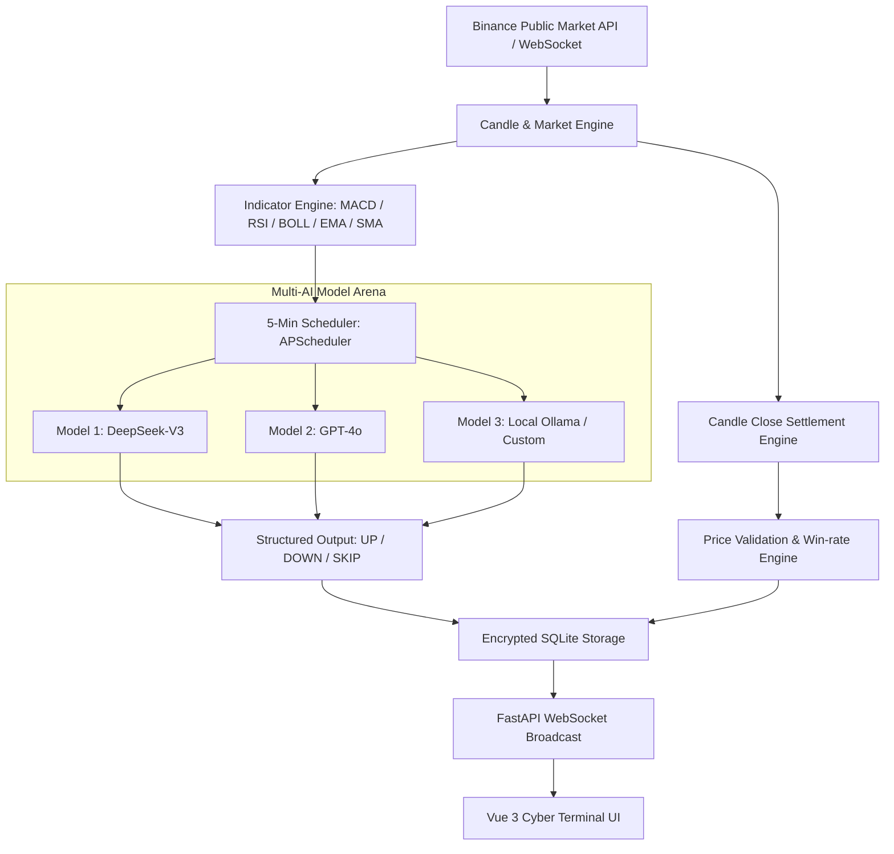

<div align="center">

# ⚡ VectorBTC

**5-Minute (M5) High-Frequency BTC Quantitative UP/DOWN Prediction & Multi-AI Model Arena**

[](LICENSE)
[](https://www.python.org/)
[](https://fastapi.tiangolo.com/)
[](https://vuejs.org/)
[](https://vitejs.dev/)
[](docker-compose.yml)
[](https://github.com/koala9527/vectorbtc/pulls)

**English** | [简体中文](./README.md)

</div>

---

## 📖 Introduction

**VectorBTC** is a high-frequency **5-minute (M5) quantitative direction prediction and multi-AI model battle arena** designed for BTC/USDT.

Operating on a 5-minute candle cadence, the system continuously pulls live Binance market data and calculates real-time technical indicators—**MACD(12,26,9), RSI(14), Bollinger Bands(20,2), EMA(7,25), and SMA(99)**. These metrics feed into multiple concurrently running AI models (such as DeepSeek-V3/R1, GPT-4o, Claude, Qwen, and local Ollama) to deduce next-candle price action (`UP`, `DOWN`, or `SKIP`).

At the close of each 5-minute candle, the engine automatically reconciles predictions against actual close prices, updates win-rate statistics, and ranks AI models in real time.

---

## 📸 Screenshots

| 5M Real-time Market & Prediction Dashboard | 5M Quantitative Win-rate Matrix & Arena |
| :---: | :---: |
|  |  |

---

## ✨ Features

- ⏱️ **5-Minute High-Frequency Cycle**
  - Pulsating beacon and interval indicator (e.g., `17:15 ~ 17:20`).
  - Down-to-the-second candle close countdown and dynamic progress bar.
- 🤖 **Multi-AI Model Arena**
  - Run multiple models concurrently with any OpenAI-compatible API (DeepSeek, OpenAI, Claude via proxy, Ollama, etc.).
  - Encrypted credential storage (Fernet symmetric encryption) with UI masking.
- 📊 **Indicator-Driven Quantitative Prompting**
  - Built-in institutional-grade prompt requiring models to cite concrete figures (RSI readings, MACD hist/DIF/DEA, EMA crossovers, Bollinger breach states).
  - Native `SKIP` support for defensive stance during uncertain chop.
- ⚖️ **Automated Settlement & Win-rate Engine**
  - APScheduler-driven candle close synchronization.
  - Overall system win rate, model leaderboards, and 7-day performance tracking.
- 🎛️ **Hot-Plug Model Management & Data Shielding**
  - Real-time connection & latency testing modal.
  - One-click active/inactive toggle: disabled models are dynamically shielded across Dashboard, Predictions, and Statistics without altering raw database integrity.
- 🌌 **Cyberpunk Dark Quantitative Terminal UI**
  - Crafted with Vue 3, Vant 4, ECharts, and Lightweight Charts.
  - Mobile-first responsive touch layout with LAN remote debugging support.
- 🐳 **Turnkey Dockerization**
  - Single-command `docker compose up -d` with persistent SQLite volume.
  - Automated CI/CD pipeline with GitHub Actions.

---

## 🏗️ Architecture



---

## 🚀 Quick Start

### Option 1: Docker Compose (Recommended)

```bash
# 1. Clone the repository
git clone git@github.com:koala9527/vectorbtc.git
cd vectorbtc

# 2. Copy environment template
cp .env.example .env

# 3. Start full-stack services
docker compose up -d

# 4. Check service status
docker compose ps
```

* Web UI: **http://localhost:8029** (configurable via `FRONTEND_PORT`)
* API Docs (Swagger): **http://localhost:8009/docs** (configurable via `BACKEND_PORT`)

---

### Option 2: Local Development

#### Backend (FastAPI + Python 3.12)
```bash
cd backend
python -m venv venv
# Windows:
.\venv\Scripts\activate
# Linux / macOS:
source venv/bin/activate

pip install -r requirements.txt
cp .env.example .env
uvicorn app.main:app --host 0.0.0.0 --port 8000 --reload
```

#### Frontend (Vue 3 + Vite)
```bash
cd frontend
npm install
npm run dev
```

---

## ⚠️ Disclaimer

1. All predictions and quantitative analysis produced by this project are strictly for academic research, algorithmic demonstration, and technical experimentation. **None of the contents constitute financial, investment, or trading advice.**
2. Digital assets carry high market risk and volatility. The authors assume no liability for any financial losses or damages incurred through real-money trading based on this software.

---

## 📄 License

This project is licensed under the [MIT License](LICENSE).
