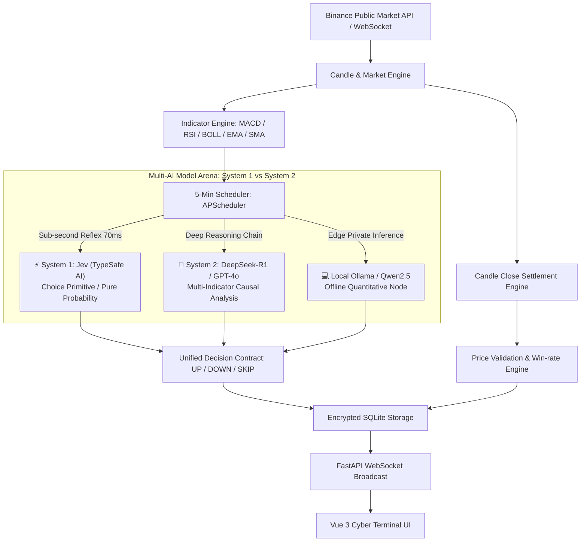

<div align="center">

# ⚡ VectorBTC

**5-Minute (M5) High-Frequency BTC Quantitative UP/DOWN Prediction & Multi-AI Model Arena**

[](LICENSE)
[](https://openrouter.ai/models/typesafe/jev-latest)
[](https://www.python.org/)
[](https://fastapi.tiangolo.com/)
[](https://vuejs.org/)
[](https://vitejs.dev/)
[](docker-compose.yml)
[](https://github.com/koala9527/vectorbtc/pulls)

**English** | [简体中文](./README.md)

</div>

---

## 📖 Introduction

**VectorBTC** is a high-frequency **5-minute (M5) quantitative direction prediction and multi-AI model battle arena** designed for BTC/USDT.

Operating on a 5-minute candle cadence, the system continuously pulls live Binance market data and calculates real-time technical indicators—**MACD(12,26,9), RSI(14), Bollinger Bands(20,2), EMA(7,25), and SMA(99)**. These metrics feed into dual AI paradigm engines:
- ⚡ **System 1 (Instant Market Reflex)**: Built-in support for **Jev** (`typesafe/jev-latest`) by TypeSafe AI (ex-OpenAI researchers)—a non-autoregressive decision model with **70ms ~ 500ms latency**, zero hallucinations, and 400x lower inference cost.
- 🧠 **System 2 (Deep Reasoning Chains)**: Deep multi-indicator qualitative synthesis powered by **DeepSeek-R1 / V3**, **GPT-4o**, **Claude 3.5 Sonnet**, and private **Ollama** instances.

At the close of each 5-minute candle, the engine automatically reconciles predictions against actual close prices, updates win-rate statistics, and ranks AI models in real time.

---

## 📸 Screenshots

| 5M Real-time Market & Prediction Dashboard | 5M Quantitative Win-rate Matrix & Arena |
| :---: | :---: |
|  |  |

---

## ✨ Features

- ⏱️ **5-Minute High-Frequency Cycle**
  - Pulsating beacon and interval indicator (e.g., `17:15 ~ 17:20`).
  - Down-to-the-second candle close countdown and dynamic progress bar.
- ⚡ **Frontier System 1 (Jev) vs System 2 (DeepSeek/GPT) Dual-Process Arena**
  - **Jev (TypeSafe AI) Sub-Second Reflex**: Non-autoregressive decision model using typed `Choice` primitives, achieving **70ms response time**, zero hallucination, and 400x cost reduction.
  - **DeepSeek-R1 / GPT-4o Deep Thinking**: Multi-indicator technical breakdown, resistance/support verification, and explicit numerical citations.
  - First platform to benchmark fast instinct (System 1) against deep deliberative reasoning (System 2) in live high-frequency markets.
- 🤖 **Multi-AI Model Arena**
  - Run multiple models concurrently with any OpenAI-compatible API (DeepSeek, OpenAI, Claude via proxy, Ollama, etc.).
  - Encrypted credential storage (Fernet symmetric encryption) with UI masking.
- 📊 **Indicator-Driven Quantitative Prompting**
  - Built-in institutional-grade prompt requiring models to cite concrete figures (RSI readings, MACD hist/DIF/DEA, EMA crossovers, Bollinger breach states).
  - Native `SKIP` support for defensive stance during uncertain chop.
- ⚖️ **Automated Settlement & Win-rate Engine**
  - APScheduler-driven candle close synchronization.
  - Overall system win rate, model leaderboards, and 7-day performance tracking.
- 🎛️ **Hot-Plug Model Management & Data Shielding**
  - Real-time connection & latency testing modal.
  - One-click active/inactive toggle: disabled models are dynamically shielded across Dashboard, Predictions, and Statistics without altering raw database integrity.
- 🌌 **Cyberpunk Dark Quantitative Terminal UI**
  - Crafted with Vue 3, Vant 4, ECharts, and Lightweight Charts.
  - Mobile-first responsive touch layout with LAN remote debugging support.
- 🐳 **Turnkey Dockerization**
  - Single-command `docker compose up -d` with persistent SQLite volume.
  - Automated CI/CD pipeline with GitHub Actions.

---

## 🏗️ Architecture



---

## 🚀 Quick Start

### Option 1: Docker Compose (Recommended)

```bash
# 1. Clone the repository
git clone git@github.com:koala9527/vectorbtc.git
cd vectorbtc

# 2. Copy environment template
cp .env.example .env

# 3. Start full-stack services
docker compose up -d

# 4. Check service status
docker compose ps
```

* Web UI: **http://localhost:8029** (configurable via `FRONTEND_PORT`)
* API Docs (Swagger): **http://localhost:8009/docs** (configurable via `BACKEND_PORT`)

---

### Option 2: Local Development

#### Backend (FastAPI + Python 3.12)
```bash
cd backend
python -m venv venv
# Windows:
.\venv\Scripts\activate
# Linux / macOS:
source venv/bin/activate

pip install -r requirements.txt
cp .env.example .env
uvicorn app.main:app --host 0.0.0.0 --port 8000 --reload
```

#### Frontend (Vue 3 + Vite)
```bash
cd frontend
npm install
npm run dev
```

---

## 🤖 Model Configuration Matrix

VectorBTC connects to any OpenAI-compatible endpoint. Navigate to the **Settings** view in the UI and click **"Add Model"**:

| Platform / Model | Base URL | Model Name | Description |
| :--- | :--- | :--- | :--- |
| **TypeSafe Jev (System 1)** ⚡ | `https://openrouter.ai/api/v1` | `typesafe/jev-latest` | **Ex-OpenAI team non-autoregressive decision model**. 70ms sub-second response, zero hallucination, 400x cost reduction, deterministic probabilities |
| **DeepSeek V3 / R1 (System 2)** | `https://api.deepseek.com/v1` | `deepseek-chat` / `deepseek-reasoner` | High cost-to-performance ratio, multi-step Chain-of-Thought quantitative deduction |
| **OpenAI** | `https://api.openai.com/v1` | `gpt-4o` / `gpt-4o-mini` | Canonical general-purpose baseline |
| **Aliyun Qwen** | `https://dashscope.aliyuncs.com/compatible-mode/v1` | `qwen-plus` / `qwen-turbo` | OpenAI compatible endpoint |
| **Moonshot (Kimi)** | `https://api.moonshot.cn/v1` | `moonshot-v1-8k` | Long-context quantitative synthesis |
| **Local Ollama** | `http://host.docker.internal:11434/v1` | `qwen2.5:7b` / `llama3.1` | Completely offline and private |

> 💡 **Tip**: Each model card provides an interactive **"Test Connection"** button. Clicking it executes an immediate real-world M5 simulation run against the latest Binance indicators, displaying end-to-end latency in milliseconds and the deduced action.

---

## ⚡ Frontier Spotlight: Jev (TypeSafe AI) System 1 Decision Model in Action

In September 2026, **TypeSafe AI** (founded by ex-OpenAI researcher Diogo Almeida) unveiled **Jev** (`typesafe/jev-latest`), sparking significant attention across the AI and FinTech landscapes. Jev marks a transition from open-ended text generation toward **purpose-built, structured System 1 decision-making**.

VectorBTC is the first quantitative framework to implement **Kahneman's Dual-Process Cognitive Architecture** for high-frequency crypto asset forecasting:

### 1. Why High-Frequency Quantitative Trading Needs Jev

Classical autoregressive LLMs excel at prolonged deliberative reasoning (System 2 slow thinking) but face severe headwinds in fast-paced 5-minute trading environments:
1. **Generation Latency**: Token-by-token autoregression takes 2~6 seconds, leading to stale execution in volatile regimes;
2. **Structural Hallucination Risk**: Occasional markdown code fences or invalid JSON outputs can drop signals;
3. **Compounding API Costs**: 288 cycles per day across multiple models scales token expenses rapidly.

**How Jev Solves This:**
- **Non-Autoregressive Decision Output**: Returns native machine-readable probabilistic evaluations directly without gratuitous prose;
- **Sub-Second Execution (70ms ~ 500ms)**: Over 100x faster than traditional LLMs, providing a reflex-like signal pipeline;
- **400x Cost Reduction**: Priced at approximately $0.042 per 1M tokens, enabling 24/7 high-density quantitative forecasting;
- **Zero Syntax Hallucinations**: Strict type safety via decision primitives (`Choice`, `Score`, `Noul`).

### 2. Live Battle Division in VectorBTC

| Dimension | ⚡ System 1: Jev Decision Model | 🧠 System 2: DeepSeek-R1 / GPT-4o |
| :--- | :--- | :--- |
| **Cognitive Analogy** | **Fast Reflex: Instant orderbook intuition** | **Slow Deliberation: Deep Wall St. analyst reasoning** |
| **Core Primitive** | Direct probabilistic `Choice(UP, DOWN, SKIP)` | Step-by-step Chain-of-Thought (CoT) deduction |
| **Latency** | **70ms ~ 200ms** | 1,500ms ~ 5,000ms+ |
| **Output Type** | Categorical decision + rigorous branch confidence | Narrative technical justification & resistance analysis |
| **Tactical Role** | **Frontline Scout** (Breakout detection, extreme oversold/overbought) | **Strategic Commander** (Multi-indicator synthesis & macro trends) |

### 3. How to Connect Jev in 60 Seconds

Jev is fully accessible via OpenRouter's standard OpenAI-compatible API:
1. Obtain an API key from [OpenRouter](https://openrouter.ai/);
2. Go to VectorBTC Web UI -> **Settings** -> **"Add Model"**;
3. Configure the model:
   - **Name**: `Jev (System 1 Instant)`
   - **Base URL**: `https://openrouter.ai/api/v1`
   - **Model Name**: `typesafe/jev-latest`
   - **API Key**: `sk-or-v1-xxxxxxxx...`
4. Click **"Test Connection"** to witness **< 200ms** sub-second quantitative prediction!

---

## ⚠️ Disclaimer

1. All predictions and quantitative analysis produced by this project are strictly for academic research, algorithmic demonstration, and technical experimentation. **None of the contents constitute financial, investment, or trading advice.**
2. Digital assets carry high market risk and volatility. The authors assume no liability for any financial losses or damages incurred through real-money trading based on this software.

---

## 📄 License

This project is licensed under the [MIT License](LICENSE).
